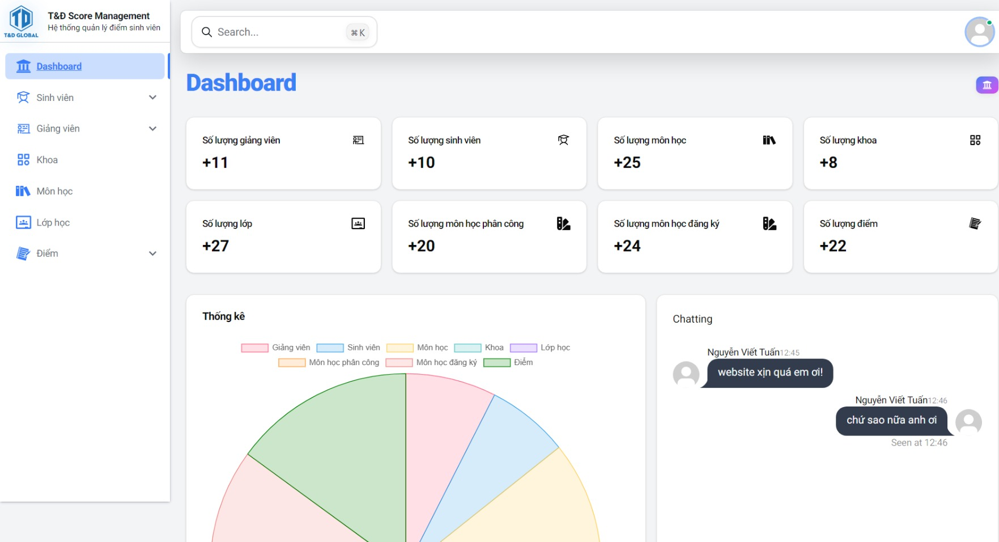
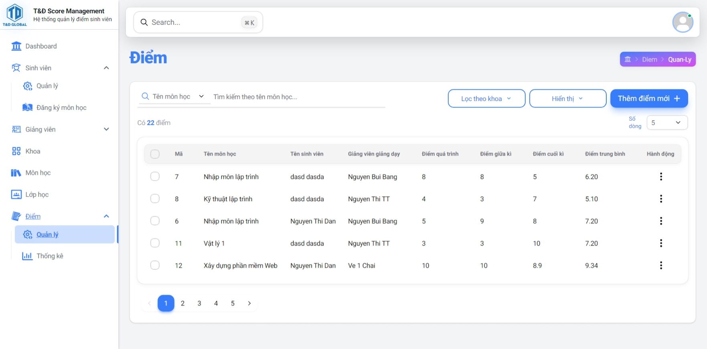

# Full Stack Score Management

## Technology Stack and Features

- ⚡ [**Go Fiber**](https://gofiber.io/) for the Golang backend API.
    - 🧰 [Gorm](https://gorm.io/) for the Golang SQL database interactions (ORM).
    - 🔍 [Validator](https://pkg.go.dev/github.com/go-playground/validator/v10), used by Go Fiber, for the data validation.
    - 💾 [PostgreSQL](https://www.postgresql.org) as the SQL database.
    - ...
- 🚀 [NextJS](https://nextjs.org/) for the frontend.
    - 💃 Using TypeScript, hooks, and other parts of a modern frontend stack.
    - 🔗 [Tanstack Query](https://tanstack.com/query/latest), for api call with cache, retry features.
    - 🐻 [Zudstand](https://tanstack.com/query/latest), a small, fast and scalable state-management solution using simplified flux principles.
    - 🎨 [Shadcn UI](https://ui.shadcn.com/) for the frontend components.
    - 🎨 [Next UI](https://nextui.org/) for the frontend components.
    - 🎨 [Daisy UI](https://daisyui.com/) for the frontend components.
    - 🤖 An automatically generated frontend client.
    - ...
- 🔒 Secure password hashing by default.
- 🔑 JWT token authentication.
- ⚙️ Restful API, MVC architecture

### Dashboard Login

### Dashboard - Home

### Dashboard - Grade

## How To Use It

You can **just clone** this repository and use it as is.

✨ It just works. ✨
